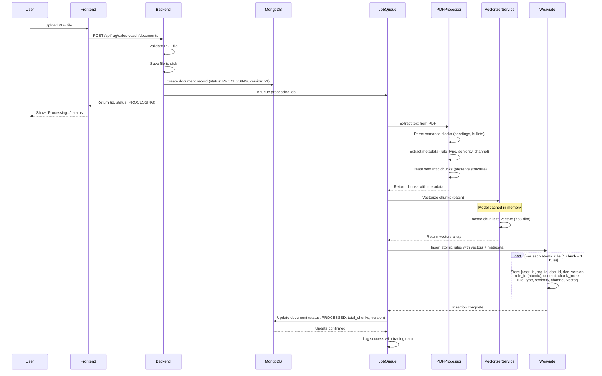
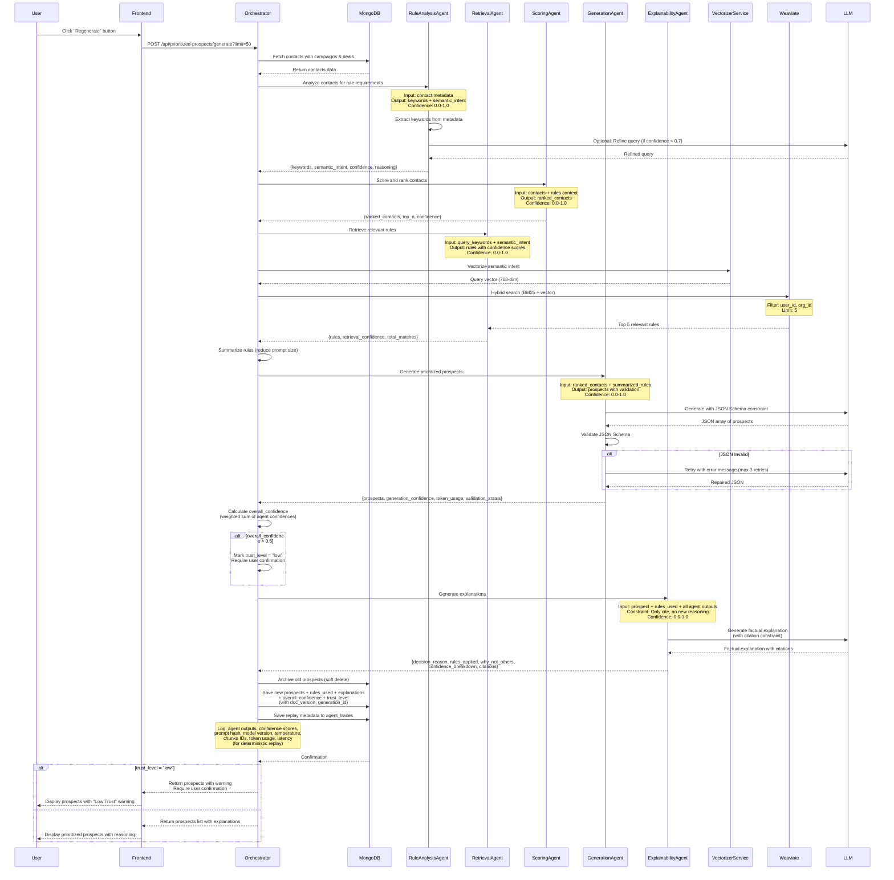

# Technical Architecture: RAG-Enhanced AI Sales Copilot System

## Table of Contents
1. [System Overview](#system-overview)
2. [Revenue-Critical Design Principles](#revenue-critical-design-principles)
3. [System Components](#system-components)
4. [Document Upload and Vectorization Flow](#document-upload-and-vectorization-flow)
5. [Prioritized Prospect Generation Flow](#prioritized-prospect-generation-flow)

---

## Revenue-Critical Design Principles

This system is designed for **scale (100+ users) and revenue-critical operations**. Four key principles ensure reliability and trust:

### 1. Hard Confidence & Trust Rules (Uncertainty-Aware)

**Problem**: Sales decisions involve money → cannot trust vague scalar confidence scores. Scalar scores don't distinguish between:
- **Epistemic uncertainty** (lack of data)
- **Aleatoric uncertainty** (noisy data)
- **Model uncertainty** (agent instability)

**Solution**: **Separate Confidence from Uncertainty** with hard breakdown:

- **Confidence** (Scalar, 0-1): Agent's belief in the output quality
- **Uncertainty** (Multi-dimensional): Breakdown of what we don't know

- **Uncertainty Components** (Separated from Confidence):
  - **`data_coverage`** (0-1): How much contact data available
    - `0.0` = No data, `1.0` = Complete data
    - **Epistemic uncertainty**: "We don't have enough data"
  - **`rule_match_quality`** (0-1): Quality of rule matches from retrieval
    - `0.0` = No rules match, `1.0` = Perfect rule matches
    - **Epistemic uncertainty**: "We don't have relevant rules"
  - **`retrieval_strength`** (0-1): Strength of retrieval results
    - `0.0` = Weak retrieval, `1.0` = Strong retrieval
    - **Aleatoric uncertainty**: "Retrieval quality is uncertain"
  - **`contact_data_completeness`** (0-1): Contact data completeness
    - `0.0` = Incomplete, `1.0` = Complete
    - **Epistemic uncertainty**: "Contact data is incomplete"
  - **`agent_stability`** (0-1): Historical agent consistency
    - `0.0` = Unstable, `1.0` = Stable
    - **Model uncertainty**: "Agent output varies"

- **Confidence vs Uncertainty**:
  - **High Confidence + Low Uncertainty** → High Trust (auto-approve)
  - **High Confidence + High Uncertainty** → Medium Trust (review recommended)
  - **Low Confidence + Low Uncertainty** → Low Trust (require confirmation)
  - **Low Confidence + High Uncertainty** → Blocked (reject all)

- **Hard Rules** (Based on Uncertainty, Not Just Confidence):
  - **`data_coverage < 0.5`** (High Epistemic Uncertainty) → **BLOCK** (do not recommend, reject all prospects)
  - **`rule_match_quality < 0.4`** (High Epistemic Uncertainty) → **REQUIRE MANUAL REVIEW**
  - **`retrieval_strength < 0.5`** (High Aleatoric Uncertainty) → **WARN USER**
  - **`agent_stability < 0.6`** (High Model Uncertainty) → **FLAG FOR REVIEW**
  - **`overall_confidence >= 0.7` AND `uncertainty_penalty < 0.2`** → **AUTO-APPROVE**
  - **Otherwise** → **REQUIRE USER CONFIRMATION**

- **Uncertainty-Aware Trust Calculation**:
  ```typescript
  // Separate confidence from uncertainty
  confidence = agent_outputs.confidence  // Scalar (0-1)
  uncertainty = {
    epistemic: average([data_coverage, rule_match_quality, contact_data_completeness]),
    aleatoric: retrieval_strength,
    model: agent_stability
  }
  
  // Trust level based on BOTH confidence AND uncertainty
  if (uncertainty.epistemic < 0.5) {
    trust_level = "blocked"  // Don't know enough
  } else if (confidence >= 0.7 && uncertainty.epistemic >= 0.8 && uncertainty.aleatoric >= 0.7) {
    trust_level = "high"  // Know enough, confident
  } else if (confidence >= 0.6 && uncertainty.epistemic >= 0.6) {
    trust_level = "medium"  // Know enough, but less confident
  } else {
    trust_level = "low"  // Don't know enough OR not confident
  }
  ```

- **Revenue-Critical Guarantees**:
  - **Uncertainty Separation**: Confidence and uncertainty are separate, not combined
  - **Epistemic vs Aleatoric**: System distinguishes "don't know" vs "noisy data"
  - **No Recommendations Without Data**: High epistemic uncertainty → block
  - **Transparent Breakdown**: Both confidence and uncertainty visible to users
  - **Hard Thresholds**: No fuzzy logic, clear cut-off points
  - **Full Audit Trail**: All confidence and uncertainty values logged for compliance
  - **Sales-Friendly**: Clear explanation of "why we're uncertain" helps sales make informed decisions

### 2. Generate → Verify Pattern (Hard Verification Layer - Critical Risk Mitigation)

**Problem**: LLM can generate logic errors even with correct JSON format. Rules can be "over-interpreted". **This is the biggest risk** that may not show up immediately but will cause issues at scale.

**Solution**: **DraftAgent + ValidationAgent** with **mandatory hard verification** (non-LLM, deterministic):

- **DraftAgent**: Generates draft prospects (LLM)
- **ValidationAgent**: **Hard verification** (non-LLM, deterministic):
  - **Rule-Contact Compatibility**: Hard checks (rule.seniority, rule.channel, rule.rule_type)
  - **Semantic Validation**: Detects hallucination (prospect mentions rules not retrieved)
  - **Consistency Check**: Priority score must align with ranking factors
  - **Format Validation**: Required fields, data types

- **Hard Rejection Rules**:
  - **Rule Mismatch** (`compatibility_score < 0.5`) → REJECT
  - **Logic Error** (prospect references rules not in `rules_used`) → REJECT
  - **Ranking Inconsistency** (priority contradicts ranking factors) → REJECT
  - **Format Error** (missing fields, invalid types) → REJECT

- **Hard Verification Process**:
  1. **DraftAgent** generates prospects (LLM) → **Draft Output**
  2. **ValidationAgent** verifies ALL prospects (deterministic) → **Verified Output**
  3. **BusinessGuardrailsAgent** checks compliance (deterministic) → **Final Output**
  4. **Only verified prospects** reach the user

- **Verification Coverage**:
  - **100% of prospects** must pass validation (no exceptions)
  - **Rejected prospects** are logged with violation type for analysis
  - **Validation failures** trigger alerts for system improvement

- **Revenue-Critical Guarantees**:
  - **No prospect reaches user without passing all hard validation checks**
  - **Logic errors are caught** before reaching sales team
  - **Hallucination detection** prevents false rule references
  - **Consistency enforcement** ensures alignment with ranking factors
  - **Fail-Close**: If validation fails, reject (not fail-open)
  - **Zero Tolerance**: Even one violation → reject prospect

### 3. Template-Based Explainability (Legal-Safe, Zero LLM Reasoning)

**Problem**: LLM can add hidden reasoning even with prompt constraints. Legal/compliance requires **100% factual explanations** with no hallucination risk. Current approach still uses LLM for slot filling, which is not "legal-safe" enough.

**Solution**: **Pure template-based approach** with **ZERO LLM reasoning** (LLM only for optional text formatting):

- **Architecture**:
  - **Templates**: Pre-defined explanation templates (no LLM generation)
  - **Slot Filling**: Deterministic from agent outputs (no LLM)
  - **Citation Graph**: Structured references (rule_id, doc_id, values)
  - **Text Formatting** (Optional): LLM ONLY for minimal formatting (synonyms, grammar), **NO reasoning**

- **Hard Constraints** (Legal-Safe):
  - **ZERO LLM Reasoning**: LLM **ONLY** for optional text formatting (synonyms, grammar), **NEVER for reasoning**
  - **Template-First**: All explanations use pre-defined templates (no LLM generation)
  - **Deterministic Slot Filling**: Extract values from agent outputs (no LLM interpretation)
  - **Citation-Only**: All reasoning cites specific agent outputs (rule_id, doc_id, values)
  - **No Causal Inference**: Cannot infer new causal links, only cite existing facts
  - **Deterministic**: Same inputs → same explanation (100% reproducible)
  - **Audit Trail**: Every explanation has full citation graph for legal review

- **Legal-Safe Process**:
  1. **Extract Citations**: Pull rule_id, doc_id, values from agent outputs (deterministic)
  2. **Fill Templates**: Insert citations into pre-defined templates (deterministic)
  3. **Format Text** (Optional): LLM ONLY for minimal formatting (synonyms, grammar), **NOT reasoning**
  4. **Build Citation Graph**: Structured references for legal audit
  5. **No LLM Fallback**: If formatting fails, return pure template (no LLM reasoning)

- **Legal-Safe Guarantees**:
  - **100% Factual**: All explanations cite specific sources (rule_id, doc_id)
  - **Zero Hallucination Risk**: No LLM reasoning means no hidden reasoning
  - **Fully Traceable**: Every claim can be traced to source (agent output)
  - **Audit-Ready**: Citation graph provides complete audit trail
  - **Compliance-Safe**: Meets legal requirements for AI explainability
  - **Deterministic**: Same inputs always produce same explanation
  - **No Hidden Reasoning**: Template-based approach prevents LLM from adding reasoning

### 4. Fine-Tuned Feedback Loop (Long Sales Cycles)

**Problem**: Pending feedback can be noisy. Long sales cycles require delayed attribution.

**Solution**: **Outcome attribution windows** and **user reputation weighting**:

- **Outcome Attribution Window**:
  - **`pending`** → **NO UPDATE** (hard rule: wait for outcome)
  - **`won/lost`** → Weighted by `time_to_close`:
    - Very Short (< 3 days): `weight = 1.0`
    - Short (3-7 days): `weight = 0.95`
    - Medium (7-30 days): `weight = 0.8`
    - Long (30-90 days): `weight = 0.6`
    - Very Long (> 90 days): `weight = 0.4`
  - **Hard Rule**: `time_to_close > 180 days` → Flag for manual review

- **User Reputation Weighting**:
  - **Power Users** (100+ feedbacks, >80% accuracy): `reputation = 0.9-1.0`
  - **Regular Users** (20-100 feedbacks, >70% accuracy): `reputation = 0.7-0.9`
  - **New Users** (<20 feedbacks): `reputation = 0.5-0.7` (default)
  - **Low Reputation** (<50% accuracy): `reputation = 0.3-0.5`
  - **Hard Rule**: `reputation < 0.3` → Require manual review

- **Revenue-Critical Guarantee**: Feedback respects sales cycle delays and user reputation, preventing noise from affecting knowledge base.

---

## System Overview

The RAG-Enhanced AI Sales Copilot is an intelligent sales assistance system that combines:
- **Retrieval-Augmented Generation (RAG)** for context-aware sales rule retrieval
- **Large Language Models (LLM)** for intelligent analysis and content generation
- **Vector Database (Weaviate)** for semantic search of sales knowledge
- **Document Processing Pipeline** for PDF ingestion and vectorization

### High-Level Architecture

```
┌─────────────────────────────────────────────────────────────────┐
│                        Frontend (React)                         │
│  - RAG Sales Coach Page (Document Management)                  │
│  - AI Sales Copilot Page (Prioritized Prospects)              │
│  - Feedback Interface (Accept/Reject Actions)                  │
└───────────────────────┬───────────────────────────────────────┘
                         │
                         │ HTTP/REST API
                         │
┌────────────────────────▼───────────────────────────────────────┐
│                    Backend (FastAPI)                            │
│  ┌─────────────────────────────────────────────────────────┐  │
│  │  Multi-Agent Orchestrator                                │  │
│  │  ┌──────────────┬──────────────┬──────────────┐        │  │
│  │  │ RuleAnalysis │ Retrieval    │ Scoring      │        │  │
│  │  │ Agent       │ Agent        │ Agent        │        │  │
│  │  ├──────────────┼──────────────┼──────────────┤        │  │
│  │  │ Generation  │ Explainability│ Feedback     │        │  │
│  │  │ Agent       │ Agent        │ Agent        │        │  │
│  │  └──────────────┴──────────────┴──────────────┘        │  │
│  └─────────────────────────────────────────────────────────┘  │
└────────┬───────────────┬───────────────┬───────────────┬───────┘
         │               │               │               │
    ┌────▼────┐    ┌─────▼─────┐   ┌─────▼─────┐   ┌────▼─────┐
    │ MongoDB │    │  Weaviate │   │   LLM API │   │  Job     │
    │         │    │  (Hybrid  │   │           │   │  Queue   │
    │ - Users │    │  Search)  │   │ Model:     │   │ (Celery) │
    │ - Docs  │    │ - Rules   │   │ llama-3.3 │   │          │
    │ - Props │    │ - Vectors │   │ -70b-     │   │ - Retry  │
    │ - Versions│   │ - BM25    │   │ versatile │   │ - State  │
    │ - Feedback│   │ - Scores  │   │           │   │          │
    └─────────┘    └───────────┘   └───────────┘   └──────────┘
         │
    ┌────▼─────┐
    │ Vectorizer│
    │ Service   │
    │ (Long-lived)│
    └───────────┘
```

---

## System Components

### 1. **Frontend Layer**
- **Technology**: React + TypeScript
- **Key Pages**:
  - `/rag-sales-coach`: Document upload and management
  - `/ai-sales-copilot`: Prioritized prospects generation and viewing
  - `/ai-sales-copilot/:id`: Detailed prospect view with used rules

### 2. **Backend API Layer**
- **Technology**: FastAPI (Python)
- **Key Services**:
  - **Multi-Agent Orchestrator** (Strategy-Based, Policy-Driven):
    - **Strategy-Based Orchestration**: Supports multiple orchestration strategies (configurable, not hard-coded)
    - **Policy-Driven Routing**: Agent order and flow determined by policy config, not hard-coded logic
    - **Global Confidence Policy**: Aggregates agent confidences with uncertainty-aware weighted sum
    - **Strategy Selection**: Can run multiple strategies in parallel for A/B testing
  - **RAG Router** (`/api/rag/sales-coach/*`):
    - Document upload endpoint
    - Document listing and download
    - Semantic search in knowledge base
    - Document deletion
  - **Prioritized Prospects Router** (`/api/prioritized-prospects/*`):
    - Prospect generation endpoint
    - Prospect listing and detail retrieval
    - Prospect deletion
    - Deterministic replay endpoint
  - **RAGWeightUpdater** (Scheduled Job):
    - Batch processes feedback from RulePerformanceStore
    - Updates Weaviate rule weights with noise filtering
    - Manages rule lifecycle (active/deprecated/archived)

### 3. **Data Storage Layer**

#### MongoDB Collections
- **`users`**: User authentication and profile data
- **`rag_documents`**: Document metadata with versioning
  - Fields: filename, status, chunks count, version, embedding_model
- **`prioritized_prospects`**: Generated prospects with versioning
  - Fields: rules_used (with doc_version), generation_id, created_at, explanations, overall_confidence, trust_level
  - Soft delete support for history tracking
- **`agent_traces`**: AI tracing and observability data (for deterministic replay)
  - Fields: 
    - agent_outputs (full outputs with confidence scores)
    - confidence_scores (per-agent and overall)
    - prompt_hash, prompt_template_version
    - model_version, temperature, top_p
    - token_usage, latency
    - generation_id (for replay)
- **`feedback_records`**: User feedback and outcomes
  - Fields: prospect_id, action, outcome, rule_updates, win_rate_metrics
- **`rule_performance_store`**: Buffer for feedback before KB update
  - Fields: rule_id, proposed_confidence, reason, status, user_id, timestamp, review_required
- **`rule_lifecycle`**: Rule status and lifecycle management
  - Fields: rule_id, status (active/deprecated/archived), created_at, deprecated_at, archived_at, expiry_date

#### Weaviate Collections
- **`DataAiSaleCoach`**: Vectorized atomic rules with hybrid search
  - Properties: 
    - `user_id`, `org_id` (multi-tenant isolation)
    - `doc_id`, `doc_version` (versioning support)
    - `rule_id` (atomic rule ID, 1 chunk = 1 rule)
    - `content`, `chunk_index`
    - `rule_type` (closing|followup|objection)
    - `seniority` (SMB|Enterprise)
    - `channel` (email|call|linkedin)
    - `rule_status` (active|deprecated|archived)
    - `confidence_score` (updated by RAGWeightUpdater, not directly)
    - `created_at`, `deprecated_at`, `expiry_date`
  - Vector dimension: 768 (all-distilroberta-v1 model)
  - Search: Hybrid (BM25 + vector) with **dynamic weighting** based on query characteristics
  - **Filter**: Only `rule_status = "active"` rules are retrieved (deprecated/archived excluded)
  - **Rule Atomicity**: 1 chunk = 1 rule (IF-THEN-WHY), `rule_id` independent of `chunk_index`

### 4. **Multi-Agent System**

#### Agent Architecture Principles
- **Agent Identity**: Each agent has unique identity and responsibility
- **Input/Output Contracts**: Well-defined schemas for agent communication
- **Confidence Scores**: **Hard metrics-based** (retrieval strength, rule coverage, historical accuracy), NOT LLM self-report
- **Failure Modes**: Defined error handling and fallback strategies
- **Retry Strategy**: Agent-level retry with exponential backoff
- **Global Confidence Policy**: Orchestrator aggregates with uncertainty-aware weighted sum
- **Deterministic Replay**: All agent decisions are replayable with stored outputs (with replay mode selection)
- **Parallel Execution**: Agent dependency graph enables parallel execution where possible
- **Agent Reputation**: Historical accuracy tracking for agent-level trust
- **Strategy-Based Orchestration**: Orchestrator uses policy config, not hard-coded flow

#### Agent Definitions

##### RuleAnalysisAgent
- **Identity**: Analyzes contact metadata to determine required rules
- **Input Schema**:
  ```typescript
  {
    contacts: Array<{
      deal_stage: string,
      campaign_type: string,
      channel: string,
      deal_value: number
    }>
  }
  ```
- **Output Schema**:
  ```typescript
  {
    keywords: string[],
    semantic_intent: string,
    keyword_density: number,  // For adaptive hybrid weighting
    confidence: number,  // Based on hard metrics, NOT LLM self-report
    confidence_breakdown: {
      contact_data_completeness: number,  // Hard metric: % of contacts with complete data
      keyword_extraction_quality: number,  // Hard metric: keyword relevance score
      historical_accuracy: number  // Hard metric: past accuracy of this agent
    },
    uncertainty: {
      data_coverage: number,  // How much contact data available
      retrieval_strength: number,  // Expected retrieval quality
      agent_stability: number  // Historical consistency
    },
    reasoning: string
  }
  ```
- **Confidence Calculation** (Hard Metrics-Based):
  ```typescript
  // Confidence based on hard metrics, NOT LLM self-report
  confidence = weighted_sum({
    contact_data_completeness: 0.4,  // Hard metric
    keyword_extraction_quality: 0.4,  // Hard metric
    historical_accuracy: 0.2  // Hard metric (agent reputation)
  })
  // LLM self-report is NOT used for confidence
  ```
- **Failure Mode**: Returns default keywords if analysis fails
- **Retry**: 2 retries with confidence threshold 0.7
- **Execution**: Can run in parallel with ScoringAgent (no dependency)

##### RetrievalAgent
- **Identity**: Retrieves relevant rules from knowledge base with adaptive hybrid search
- **Input Schema**:
  ```typescript
  {
    query_keywords: string[],
    semantic_intent: string,
    keyword_density: number,  // From RuleAnalysisAgent
    semantic_intent_confidence: number,  // From RuleAnalysisAgent
    user_id: string,
    org_id: string,
    limit: number
  }
  ```
- **Output Schema**:
  ```typescript
  {
    rules: Array<{
      rule_id: string,  // Atomic rule ID (1 chunk = 1 rule)
      content: string,
      doc_id: string,
      doc_version: string,
      chunk_index: number,
      similarity_score: number,
      rule_type: string,
      confidence: number
    }>,
    retrieval_confidence: number,  // Based on hard metrics, NOT LLM self-report
    confidence_breakdown: {
      retrieval_strength: number,  // Hard metric: similarity scores quality
      rule_coverage: number,  // Hard metric: % of query covered by rules
      historical_accuracy: number  // Hard metric: past accuracy of this agent
    },
    retrieval_state: "MATCH" | "NO_MATCH" | "INSUFFICIENT_DATA" | "CONFLICTING_RULES",
    state_explanation: string,  // Why this state (deterministic, not LLM)
    uncertainty: {
      data_coverage: number,  // How many rules matched
      retrieval_strength: number,  // Quality of matches
      agent_stability: number
    },
    total_matches: number,
    hybrid_weights: {
      bm25_weight: number,  // Dynamic weight used
      vector_weight: number
    }
  }
  ```
- **Retrieval State Classification** (Explicit States):
  - **`MATCH`**: Found relevant rules (similarity_score > threshold)
  - **`NO_MATCH`**: No rules found (empty result, NOT same as insufficient data)
  - **`INSUFFICIENT_DATA`**: Query too vague or incomplete (cannot determine relevance)
  - **`CONFLICTING_RULES`**: Multiple rules with conflicting logic (requires resolution)
  
- **Confidence Calculation** (Hard Metrics-Based):
  ```typescript
  // Confidence based on hard metrics, NOT LLM self-report
  if (retrieval_state === "NO_MATCH" || retrieval_state === "INSUFFICIENT_DATA") {
    retrieval_confidence = 0.0  // Cannot be confident if no match or insufficient data
  } else {
    retrieval_confidence = weighted_sum({
      retrieval_strength: 0.5,  // Hard metric: similarity scores
      rule_coverage: 0.3,  // Hard metric: % of query covered
      historical_accuracy: 0.2  // Hard metric: past accuracy
    })
  }
  // LLM self-report is NOT used for confidence
  ```
- **Adaptive Hybrid Weighting**:
  - If `keyword_density > 0.7`: `bm25_weight = 0.7`, `vector_weight = 0.3`
  - If `semantic_intent_confidence > 0.8`: `vector_weight = 0.7`, `bm25_weight = 0.3`
  - Default: `bm25_weight = 0.5`, `vector_weight = 0.5`
- **Failure Mode**: Returns empty rules array, continues with general practices
- **Retry**: 3 retries for Weaviate connection issues
- **Execution**: Blocks GenerationAgent, but not ScoringAgent

##### ScoringAgent
- **Identity**: Scores and ranks contacts before LLM generation
- **Input Schema**:
  ```typescript
  {
    contacts: Array<Contact>
    // Note: Can run without rules (parallel with RuleAnalysisAgent)
  }
  ```
- **Output Schema**:
  ```typescript
  {
    ranked_contacts: Array<{
      contact_id: string,
      score: number,
      ranking_factors: {
        deal_value_weight: number,
        campaign_activity_weight: number,
        recency_weight: number
      },
      confidence: number,
      uncertainty: {
        data_coverage: number,  // Contact data completeness
        ranking_stability: number,  // Score consistency
        agent_stability: number
      }
    }>,
    top_n: number
  }
  ```
- **Failure Mode**: Returns all contacts if scoring fails
- **Retry**: 1 retry, fallback to simple value-based ranking
- **Execution**: Can run in parallel with RuleAnalysisAgent (no dependency)

##### DraftAgent (Phase 1 of Generation)
- **Identity**: Generates draft prioritized prospects using LLM
- **Input Schema**:
  ```typescript
  {
    ranked_contacts: Array<Contact>,
    summarized_rules: string,
    json_schema: object
  }
  ```
- **Output Schema**:
  ```typescript
  {
    draft_prospects: Array<PrioritizedProspect>,
    generation_confidence: number,
    uncertainty: {
      data_coverage: number,
      rule_contact_compatibility: number,  // Estimated compatibility
      agent_stability: number
    },
    token_usage: {
      input_tokens: number,
      output_tokens: number
    },
    raw_llm_output: string  // Stored for deterministic replay
  }
  ```
- **Failure Mode**: Returns empty prospects if generation fails
- **Retry**: 2 retries with different temperature

##### ValidationAgent (Phase 2 of Generation - Hard Verification Layer)
- **Identity**: Validates draft prospects with **deterministic checks** (non-LLM, rule-based)
- **Input Schema**:
  ```typescript
  {
    draft_prospects: Array<PrioritizedProspect>,
    rules_used: Array<Rule>,  // Atomic rules with rule_id
    ranked_contacts: Array<Contact>
  }
  ```
- **Output Schema**:
  ```typescript
  {
    validated_prospects: Array<PrioritizedProspect>,
    rejected_prospects: Array<{
      prospect: PrioritizedProspect,
      rejection_reason: string,
      rule_mismatch: boolean,
      compatibility_score: number,
      hard_rejection: boolean,  // True if violates hard rule
      violation_type: "rule_mismatch" | "logic_error" | "ranking_inconsistency" | "format_error"
    }>,
    validation_confidence: number,
    validation_status: "all_valid" | "partial" | "all_rejected"
  }
  ```
- **Hard Validation Checks** (Deterministic, Non-LLM):
  1. **Rule-Contact Compatibility Check**:
     - Extract `rule_type`, `seniority`, `channel` from atomic rule
     - Extract `contact.deal_stage`, `contact.campaign_type`, `contact.channel` from contact
     - **Hard Rule**: If `rule.seniority !== contact.deal_value_tier` → REJECT
     - **Hard Rule**: If `rule.channel !== contact.channel` → REJECT (unless rule.channel = "all")
     - **Hard Rule**: If `rule.rule_type` doesn't match `contact.deal_stage` → REJECT
     - **Compatibility Score**: 0.0 if incompatible, 1.0 if fully compatible
  
  2. **Semantic Validation** (Rule Logic Check):
     - Parse prospect `strategy` text
     - Extract keywords from `rules_used[].content`
     - **Hard Rule**: If prospect strategy mentions rule keywords but rule not in `rules_used` → REJECT (hallucination)
     - **Hard Rule**: If prospect strategy contradicts rule logic → REJECT
     - **Check**: Prospect `priority_score` must align with rule `confidence_score`
  
  3. **Consistency Check** (Ranking Factors):
     - Extract `ranking_factors` from ScoringAgent output
     - Extract `priority_score` from prospect
     - **Hard Rule**: If `priority_score` contradicts `ranking_factors` → REJECT
     - **Check**: Prospect `contact_id` must exist in `ranked_contacts`
     - **Check**: Prospect ranking order must align with `ranked_contacts` order
  
  4. **Format & Structure Validation**:
     - **Hard Rule**: Required fields missing → REJECT
     - **Hard Rule**: Invalid data types → REJECT
     - **Check**: Prospect `rules_used` must reference valid `rule_id`s

- **Hard Rejection Rules** (Revenue-Critical):
  ```typescript
  // HARD REJECTION 1: Rule Mismatch
  if (compatibility_score < 0.5) {
    reject_prospect(prospect, "rule_mismatch", "Rule does not apply to this contact type")
  }
  
  // HARD REJECTION 2: Logic Error (Hallucination)
  if (prospect.strategy contains keywords NOT in rules_used) {
    reject_prospect(prospect, "logic_error", "Prospect strategy references rules not retrieved")
  }
  
  // HARD REJECTION 3: Ranking Inconsistency
  if (prospect.priority_score contradicts ranking_factors) {
    reject_prospect(prospect, "ranking_inconsistency", "Priority score contradicts ranking factors")
  }
  
  // HARD REJECTION 4: Format Error
  if (required_fields missing OR invalid_types) {
    reject_prospect(prospect, "format_error", "Invalid prospect structure")
  }
  ```

- **Validation Process**:
  1. **Deterministic Checks First**: All hard rules applied (no LLM)
  2. **Reject Invalid Prospects**: Hard rejections logged with violation type
  3. **Accept Valid Prospects**: Only prospects passing all checks proceed
  4. **Confidence Calculation**: `validation_confidence = (validated_count / total_count)`

- **Failure Mode**: **Fail-Close** (reject all if validation fails, not fail-open)
- **Retry**: No retry (deterministic validation, no randomness)
- **Revenue-Critical Guarantee**: No prospect reaches user without passing all hard validation checks

##### GenerationAgent (Composite)
- **Identity**: Orchestrates DraftAgent + ValidationAgent
- **Process**: Draft → Validate → Return validated prospects
- **Output Schema**:
  ```typescript
  {
    prospects: Array<PrioritizedProspect>,
    generation_confidence: number,  // Based on hard metrics, NOT LLM self-report
    confidence_breakdown: {
      validation_pass_rate: number,  // Hard metric: % of prospects passing validation
      rule_contact_compatibility: number,  // Hard metric: compatibility scores
      historical_accuracy: number  // Hard metric: past accuracy of this agent
    },
    uncertainty: {
      data_coverage: number,
      rule_contact_compatibility: number,
      agent_stability: number
    },
    token_usage: { input_tokens, output_tokens },
    validation_status: "all_valid" | "partial" | "all_rejected",
    raw_llm_output: string  // For deterministic replay
  }
  ```
- **Confidence Calculation** (Hard Metrics-Based):
  ```typescript
  // Confidence based on hard metrics, NOT LLM self-report
  generation_confidence = weighted_sum({
    validation_pass_rate: 0.5,  // Hard metric: % passing validation
    rule_contact_compatibility: 0.3,  // Hard metric: compatibility scores
    historical_accuracy: 0.2  // Hard metric: past accuracy
  })
  // LLM self-report is NOT used for confidence
  ```

##### ExplainabilityAgent (Template-Based, No LLM Reasoning)
- **Identity**: Explains AI decisions using **pure template-based approach** with rule_id citations (LLM only for minimal text formatting, NO reasoning)
- **Input Schema**:
  ```typescript
  {
    prospect: PrioritizedProspect,
    rules_used: Array<Rule>,  // Atomic rules with rule_id
    ranked_contacts: Array<Contact>,
    agent_outputs: {
      rule_analysis: RuleAnalysisOutput,
      retrieval: RetrievalOutput,
      scoring: ScoringOutput,
      generation: GenerationOutput,
      validation: ValidationOutput
    },
    confidence_breakdown: {
      data_coverage: number,
      rule_match_quality: number,
      retrieval_strength: number,
      contact_data_completeness: number,
      agent_stability: number
    }
  }
  ```
- **Output Schema**:
  ```typescript
  {
    decision_reason: string,  // Pure template, no LLM reasoning
    rules_applied: Array<{
      rule_id: string,  // Atomic rule reference (required)
      rule_content: string,
      relevance_score: number,
      why_applied: string,  // Template: "Rule {rule_id} from {doc_id} applied"
      source: "rule_analysis" | "retrieval",
      citation: string  // Direct citation to agent output
    }>,
    why_not_others: string,  // Template: "Contact {id} ranked lower: {factor}={value}"
    confidence_breakdown: {
      data_coverage: number,  // Hard metric
      rule_match_quality: number,  // Hard metric
      retrieval_strength: number,  // Hard metric
      contact_data_completeness: number,  // Hard metric
      agent_stability: number,  // Hard metric
      overall_confidence: number
    },
    explanation_confidence: number,  // Always 1.0 for template-based (deterministic)
    citation_graph: {
      rules_cited: Array<{rule_id: string, doc_id: string, citation_text: string}>,
      ranking_factors_cited: Array<{factor: string, value: number, source: "scoring_agent"}>,
      confidence_values_cited: Array<{source: string, value: number, component: string}>
    },
    hard_rules_applied: Array<{
      rule_name: string,
      condition: string,
      result: string,
      citation: string
    }>
  }
  ```
- **Architecture**: **Pure Template-Based** (No LLM Reasoning)
  - **Templates**: Pre-defined explanation templates (no LLM generation)
  - **Slot Filling**: **Deterministic** slot filling from agent outputs (no LLM)
  - **Citation Graph**: Structured references to agent outputs (rule_id, doc_id, values)
  - **Text Formatting**: LLM ONLY for minimal text formatting (e.g., "Contact A ranked higher than Contact B" → "Contact A was prioritized over Contact B"), **NO reasoning**
  
- **Template Examples** (Pure Templates, No LLM):
  ```typescript
  // Template 1: Decision Reason
  decision_reason_template = 
    "Prospect {prospect_id} prioritized because:\n" +
    "- Rule {rule_id} ({rule_type}) applies to {contact_type}\n" +
    "- Contact {contact_id} has {scoring_factor}={value}\n" +
    "- Data coverage: {data_coverage}%, Rule match: {rule_match_quality}%"
  
  // Template 2: Rules Applied
  rule_applied_template = 
    "Rule {rule_id} from document {doc_id}:\n" +
    "- Content: {rule_content}\n" +
    "- Relevance: {relevance_score}\n" +
    "- Applied because: {citation_to_rule_analysis_output}"
  
  // Template 3: Why Not Others
  why_not_others_template = 
    "Contact {contact_id} ranked lower:\n" +
    "- {factor_1}: {value_1} (vs {top_contact_value})\n" +
    "- {factor_2}: {value_2} (vs {top_contact_value})"
  
  // Template 4: Confidence Breakdown
  confidence_breakdown_template = 
    "Confidence Breakdown:\n" +
    "- Data Coverage: {data_coverage}% (threshold: 50%)\n" +
    "- Rule Match Quality: {rule_match_quality}% (threshold: 40%)\n" +
    "- Retrieval Strength: {retrieval_strength}% (threshold: 50%)\n" +
    "- Overall: {overall_confidence}% (trust_level: {trust_level})"
  ```

- **Hard Constraints** (Revenue-Critical):
  - **NO LLM Reasoning**: LLM only used for text formatting (synonyms, grammar), NOT for reasoning
  - **Template-First**: All explanations use pre-defined templates
  - **Citation-Only**: All reasoning must cite specific agent outputs (rule_id, doc_id, values)
  - **No Causal Inference**: Cannot infer new causal links, only cite existing outputs
  - **Deterministic**: Same inputs → same explanation (no randomness)
  - **Legal/Compliance Safe**: No hallucination, all facts traceable to sources

- **Process**:
  1. **Extract Citations**: Pull rule_id, doc_id, values from agent outputs
  2. **Fill Templates**: Deterministic slot filling (no LLM)
  3. **Format Text** (Optional): LLM only for minimal text formatting (synonyms, grammar)
  4. **Build Citation Graph**: Structured references for audit trail

- **Failure Mode**: Returns pure template explanation with citations (no LLM fallback needed)
- **Retry**: No retry (deterministic, no randomness)
- **Revenue-Critical Guarantee**: All explanations are factual, traceable, and audit-ready

##### FeedbackAgent
- **Identity**: Processes user feedback with outcome attribution and reputation weighting
- **Input Schema**:
  ```typescript
  {
    prospect_id: string,
    action: "accept" | "reject" | "modify",
    feedback: string,
    outcome?: "won" | "lost" | "pending",
    user_id: string,
    timestamp: Date,
    time_to_close?: number  // Days from prospect to outcome
  }
  ```
- **Output Schema**:
  ```typescript
  {
    feedback_recorded: boolean,
    queued_updates: Array<{
      rule_id: string,
      proposed_confidence: number,
      reason: string,
      status: "pending" | "approved" | "rejected",
      attribution_weight: number,  // Based on outcome delay
      user_reputation_weight: number  // Based on user trust score
    }>,
    feedback_confidence: number,
    requires_review: boolean,
    outcome_attribution: {
      window_applied: boolean,
      delay_weight: number,  // f(time_to_close)
      attribution_confidence: number
    }
  }
  ```
- **Outcome Attribution Window** (Fine-Tuned for Long Sales Cycles):
  - **`pending` → No update** (hard rule: wait for outcome, no premature updates)
  - **`won/lost` → Weighted by `time_to_close`** (respects sales cycle length):
    - **Very Short cycle (< 3 days)**: `attribution_weight = 1.0` (high confidence)
    - **Short cycle (3-7 days)**: `attribution_weight = 0.95` (very high confidence)
    - **Medium cycle (7-30 days)**: `attribution_weight = 0.8` (standard weight)
    - **Long cycle (30-90 days)**: `attribution_weight = 0.6` (reduced weight, longer attribution window)
    - **Very Long cycle (> 90 days)**: `attribution_weight = 0.4` (low weight, many confounding factors)
  - **Formula**: `rule_confidence_update = f(win_rate, volume, delay_weight, user_reputation)`
  - **Hard Rule**: Feedback with `pending` outcome is stored but **NOT applied** until outcome changes
  - **Hard Rule**: Feedback with `time_to_close > 180 days` is flagged for manual review (too long, may be noise)

- **User Reputation Weighting** (Fine-Tuned for Scale):
  - **`user_reputation_score`**: Calculated from historical accuracy (0-1)
    - **Power Users** (100+ feedbacks, >80% accuracy): `reputation_score = 0.9-1.0`
    - **Regular Users** (20-100 feedbacks, >70% accuracy): `reputation_score = 0.7-0.9`
    - **New Users** (<20 feedbacks): `reputation_score = 0.5-0.7` (default, increases with accuracy)
    - **Low Reputation** (<50% accuracy, many rejected feedbacks): `reputation_score = 0.3-0.5`
  - **`feedback_weight = feedback_confidence × user_reputation_score × attribution_weight`**
  - **Hard Rule**: Feedback from users with `reputation_score < 0.3` requires manual review
  - **Hard Rule**: Single user rejecting everything (outlier detection) → `reputation_score` penalty
  - **Hard Rule**: Feedback from new users (<20 feedbacks) has reduced weight until reputation established

- **Sales Cycle Awareness**:
  - **Pending Feedback Queue**: Stores all `pending` feedbacks, processes when outcome changes
  - **Attribution Delay**: Long sales cycles (>30 days) have delayed attribution to prevent noise
  - **Batch Processing**: RAGWeightUpdater processes feedbacks in batches, respecting attribution windows
  - **Noise Filtering**: Feedback with `time_to_close > 180 days` or `reputation_score < 0.3` is filtered
- **Architecture**: 
  - **FeedbackAgent** → **RulePerformanceStore** (MongoDB buffer)
  - **RAGWeightUpdater** (scheduled job) → Batch updates to Weaviate
  - **Purpose**: Prevents direct online learning, filters noise, respects outcome delays
- **Failure Mode**: Logs feedback to buffer, continues operation
- **Retry**: 1 retry for buffer writes

##### BusinessGuardrailsAgent
- **Identity**: Validates prospects against business rules, compliance, and brand guidelines
- **Input Schema**:
  ```typescript
  {
    prospects: Array<PrioritizedProspect>,
    rules_used: Array<Rule>,
    user_context: {
      region: string,
      industry: string,
      compliance_requirements: string[]
    }
  }
  ```
- **Output Schema**:
  ```typescript
  {
    validated_prospects: Array<PrioritizedProspect>,
    flagged_prospects: Array<{
      prospect: PrioritizedProspect,
      flag_reason: string,
      severity: "warning" | "block",
      compliance_issue?: string,
      brand_tone_issue?: string,
      forbidden_claim?: string
    }>,
    guardrail_confidence: number,
    validation_status: "all_clear" | "warnings" | "blocks"
  }
  ```
- **Validation Checks**:
  - **Compliance**: Legal requirements, regional restrictions
  - **Brand Tone**: Brand voice guidelines, messaging standards
  - **Forbidden Claims**: Prohibited statements, unverified claims
  - **Sales Constraints**: Industry-specific rules, deal size limits
- **Failure Mode**: Accepts all prospects if guardrails fail (fail-open with warning)
- **Retry**: No retry (deterministic rule-based validation)

### 5. **Supporting Services**

#### Vectorization Service (Long-lived)
- **Model**: `sentence-transformers/all-distilroberta-v1` (768 dimensions)
- **Architecture**: Long-running service with model cached in memory
- **Function**: Converts text chunks to embedding vectors for semantic search
- **Benefits**: Reduced memory overhead, faster processing

#### PDF Processing Service
- **Function**: Extracts text from PDF, creates semantic chunks
- **Chunking Strategy**: 
  - Semantic blocks (heading-based, bullet-group-based)
  - Preserves rule structure (IF/THEN/WHY)
  - Max 512 tokens per chunk
- **Metadata Extraction**: Rule type, seniority, channel

#### LLM Service
- **Model**: `llama-3.3-70b-versatile`
- **Function**: 
  - Used by RuleAnalysisAgent for query refinement
  - Used by GenerationAgent for prospect generation
  - Used by ExplainabilityAgent for reasoning
- **Output Control**: JSON Schema validation with retry strategy

#### Job Queue Service (Celery/RQ)
- **Function**: Manages background tasks for document processing
- **Features**:
  - Job state tracking
  - Automatic retry with exponential backoff
  - Dead-letter queue for failed jobs
  - Horizontal scaling support

#### Storage Services (Separated by Use Case)

##### MongoDB (Transactional Only)
- **Purpose**: **Transactional data only**, real-time queries
- **Collections**: 
  - `users`, `rag_documents`, `prioritized_prospects` (transactional)
  - `rule_performance_store`, `rule_lifecycle` (transactional)
  - `feedback_records` (recent, < 30 days, then moved to OLAP)
  - `ab_test_assignments` (transactional)
  - `agent_traces` (summary only, last 7 days, then moved to Object Storage)
- **NOT Used For**:
  - Metrics/analytics (moved to OLAP)
  - Full agent traces (moved to Object Storage)
  - Long-term feedback history (moved to OLAP)
- **Benefits**: Fast transactional queries, no performance degradation over time

##### Object Storage (S3/GCS) - Long-Term Traces
- **Purpose**: Large agent traces, replay metadata, raw LLM outputs
- **Data**:
  - Full `agent_traces` (after 7 days from MongoDB)
  - Raw LLM outputs for deterministic replay (audit mode)
  - Document processing logs
  - Complete agent inputs/outputs for replay
- **Benefits**: Cost-effective, scalable, long-term retention
- **Separation**: Keeps MongoDB lean, only transactional data

##### OLAP (ClickHouse/BigQuery) - Analytics & Metrics
- **Purpose**: **Analytics, metrics, A/B evaluation** (separated from transactional)
- **Data**:
  - Aggregated metrics (win-rate, rule effectiveness)
  - A/B test results and statistical analysis
  - Performance analytics (time-series)
  - User reputation scores (historical)
  - Agent historical accuracy (trends)
  - Feedback history (after 30 days from MongoDB)
- **Benefits**: 
  - Fast analytical queries (no impact on transactional DB)
  - Time-series analysis
  - No performance degradation on MongoDB
  - Scalable for large-scale analytics
- **Separation**: Keeps MongoDB lean, only transactional data

#### A/B Evaluation Service
- **Function**: Online A/B testing for rule sets and prompt versions
- **Components**:
  - **Variant Assignment**: Random assignment to A/B groups
  - **Metrics Tracking**: Win-rate, acceptance rate, time-to-close
  - **Statistical Analysis**: Significance testing, confidence intervals
  - **Variant Comparison**: Rule set A vs B, Prompt version A vs B
- **Storage**: OLAP database for analytics
- **Use Cases**:
  - Compare rule set effectiveness
  - Test prompt template improvements
  - Measure sales uplift from different strategies

#### Evaluation & Feedback Loop
- **Function**: Tracks agent performance and user feedback
- **Components**:
  - Feedback collection from sales actions
  - Win-rate uplift tracking
  - Rule effectiveness scoring
  - RAG re-weighting based on outcomes
- **Storage**: MongoDB collections for feedback and metrics

---

## Document Upload and Vectorization Flow

### Flow Diagram



### Component Interactions

#### Step 1: File Upload & Initial Storage
**Components**: Frontend → Backend → MongoDB → File System → Job Queue

1. **Frontend** sends PDF file to **Backend**
2. **Backend** validates file (PDF only) and saves to file system
3. **Backend** creates document record in **MongoDB** with:
   - `status: PROCESSING`
   - `version: v1` (versioning support)
   - `embedding_model: all-distilroberta-v1` (model tracking)
4. **Backend** enqueues processing job to **Job Queue** (Celery/RQ)
5. **Backend** returns immediately to **Frontend** (async processing)

#### Step 2: Background Processing Pipeline
**Components**: Job Queue → PDF Processor → Vectorizer Service → Weaviate → MongoDB

1. **PDF Processor** extracts text and parses semantic blocks:
   - Identifies headings, bullet points, rule structures
   - Preserves IF/THEN/WHY logic within chunks
   - Extracts metadata: `rule_type`, `seniority`, `channel`

2. **PDF Processor** creates atomic rule chunks:
   - **Rule Atomicity**: 1 chunk = 1 rule (IF-THEN-WHY structure)
   - Each chunk gets unique `rule_id` (independent of `chunk_index`)
   - Max 512 tokens per chunk
   - Maintains rule structure integrity
   - **Metadata**: Extracts `rule_type`, `seniority`, `channel` per atomic rule

3. **Vectorizer Service** (long-lived) encodes chunks:
   - Model cached in memory (no reload per job)
   - Batch processing for efficiency
   - Output: 768-dimensional vectors

4. **Weaviate** stores atomic rules with hybrid search support:
   - Properties: `user_id`, `org_id`, `doc_id`, `doc_version`, `rule_id` (atomic), `content`, `chunk_index`, `rule_type`, `seniority`, `channel`, `vector`
   - **Rule Atomicity**: Each stored object is one atomic rule (1 chunk = 1 rule)
   - Indexed for both BM25 (keyword) and vector search
   - **Retrieval**: Returns atomic rules, not just chunks

5. **MongoDB** updated with `status: PROCESSED`, `total_chunks`, `version`

**Error Handling**: 
- Job Queue handles retries with exponential backoff
- Failed jobs moved to dead-letter queue
- Document status set to `FAILED` with error message

---

## Prioritized Prospect Generation Flow

### Flow Diagram



### Multi-Agent Component Interactions

#### Agent Orchestration Flow (Strategy-Based, Policy-Driven)

**Orchestrator** coordinates agents using **strategy-based orchestration** with **policy-driven routing** (not hard-coded).

**Strategy Configuration** (Policy-Driven):
```typescript
// Orchestration Strategy (Configurable, Not Hard-Coded)
strategy_config = {
  strategy_id: "default_v1",
  agent_order: [
    { agent: "RuleAnalysisAgent", parallel_with: ["ScoringAgent"] },
    { agent: "RetrievalAgent", depends_on: ["RuleAnalysisAgent"] },
    { agent: "DraftAgent", depends_on: ["ScoringAgent", "RetrievalAgent"] },
    { agent: "ValidationAgent", parallel_with: ["BusinessGuardrailsAgent"], depends_on: ["DraftAgent"] },
    { agent: "ExplainabilityAgent", depends_on: ["ValidationAgent", "BusinessGuardrailsAgent"] }
  ],
  confidence_policy: {
    weights: { rule_analysis: 0.2, retrieval: 0.3, scoring: 0.2, generation: 0.3 },
    uncertainty_thresholds: { epistemic: 0.5, aleatoric: 0.5, model: 0.6 }
  },
  trust_level_policy: {
    blocked: { epistemic_uncertainty: "< 0.5" },
    low: { confidence: "< 0.6" },
    medium: { confidence: "0.6-0.7" },
    high: { confidence: ">= 0.7", epistemic_uncertainty: ">= 0.8" }
  }
}
```

**Agent Dependency Graph** (From Policy Config):
```
RuleAnalysisAgent ──┐
                    ├──> RetrievalAgent ──┐
ScoringAgent ──────┘                       │
                                           ├──> DraftAgent ──┐
                                                              ├──> ValidationAgent ──┐
                                                              └──> BusinessGuardrailsAgent ──┐
                                                                                              ├──> ExplainabilityAgent
                                                                                              └──> (Final Output)
```

**Strategy-Based Benefits**:
- **Multiple Strategies**: Can run different strategies in parallel for A/B testing
- **Policy-Driven**: Agent order and flow determined by config, not hard-coded
- **Easy Experimentation**: Add new agents or change flow without code changes
- **No Single Point of Intelligence**: Orchestrator is policy executor, not decision maker

**Parallel Execution**:
- **RuleAnalysisAgent** and **ScoringAgent** run in parallel (no dependencies)
- **RetrievalAgent** waits for RuleAnalysisAgent output (needs keywords + semantic_intent)
- **DraftAgent** waits for both ScoringAgent and RetrievalAgent
- **ValidationAgent** and **BusinessGuardrailsAgent** can run in parallel after DraftAgent
- **ExplainabilityAgent** waits for all previous agents

**Latency Reduction**: ~20-35% improvement vs sequential execution

**Benefits**:
- Reduced end-to-end latency
- Better resource utilization
- Failure isolation (one agent failure doesn't block others unnecessarily)
- **Strategy flexibility**: Easy to experiment with different flows
- **Policy-driven**: No hard-coded orchestration logic

#### Step 1: RuleAnalysisAgent - Analyze Contact Requirements
**Components**: Orchestrator → RuleAnalysisAgent → LLM (optional)

- **Orchestrator** sends contact metadata to **RuleAnalysisAgent**
- **RuleAnalysisAgent** analyzes:
  - Deal stages → keywords: "negotiation", "closing", "deal closure"
  - Campaign types → keywords: "cold outreach", "prospecting"
  - Channels → keywords: "email best practices", "call scripts"
  - Deal values → keywords: "enterprise", "SMB", "high-value"
- **Output Contract**:
  ```typescript
  {
    keywords: string[],
    semantic_intent: string,
    keyword_density: number,  // For adaptive hybrid weighting
    confidence: number,  // 0.0-1.0
    uncertainty: {
      data_coverage: number,  // How much contact data available
      retrieval_strength: number,  // Expected retrieval quality
      agent_stability: number  // Historical consistency
    },
    reasoning: string
  }
  ```
- **Confidence Threshold**: If < 0.7, **RuleAnalysisAgent** calls **LLM** for refinement
- **Failure Mode**: Returns default keywords, confidence = 0.5, uncertainty = {0.5, 0.5, 0.5}
- **Execution**: Runs in parallel with ScoringAgent (no dependency)

#### Step 2: ScoringAgent - Rank Contacts (Parallel)
**Components**: Orchestrator → ScoringAgent

- **Orchestrator** sends contacts to **ScoringAgent** (no rules needed, can run in parallel)
- **ScoringAgent** scores contacts based on:
  - Deal value (weighted)
  - Campaign activity (weighted)
  - Recent interactions (weighted)
- **Output Contract**:
  ```typescript
  {
    ranked_contacts: Array<{
      contact_id: string,
      score: number,
      ranking_factors: {
        deal_value_weight: number,
        campaign_activity_weight: number,
        recency_weight: number
      },
      confidence: number,
      uncertainty: {
        data_coverage: number,  // Contact data completeness
        ranking_stability: number,  // Score consistency
        agent_stability: number
      }
    }>,
    top_n: number,
    confidence: number
  }
  ```
- **Confidence Threshold**: If < 0.6, fallback to simple value-based ranking
- **Failure Mode**: Returns all contacts, confidence = 0.3
- **Execution**: Runs in parallel with RuleAnalysisAgent (no dependency)

#### Step 3: RetrievalAgent - Adaptive Hybrid Search (Atomic Rules)
**Components**: Orchestrator → RetrievalAgent → Vectorizer Service → Weaviate

1. **Orchestrator** sends query to **RetrievalAgent**:
   - Keywords from RuleAnalysisAgent
   - Semantic intent from RuleAnalysisAgent
   - **Keyword density** from RuleAnalysisAgent (for adaptive weighting)
   - **Semantic intent confidence** from RuleAnalysisAgent
   - User/org IDs for security

2. **RetrievalAgent** calculates adaptive hybrid weights:
   - If `keyword_density > 0.7`: `bm25_weight = 0.7`, `vector_weight = 0.3`
   - If `semantic_intent_confidence > 0.8`: `vector_weight = 0.7`, `bm25_weight = 0.3`
   - Default: `bm25_weight = 0.5`, `vector_weight = 0.5`

3. **RetrievalAgent** orchestrates hybrid search:
   - **Vectorizer Service** converts semantic intent to 768-dim vector
   - **Weaviate** performs Hybrid Search (BM25 + vector) with **dynamic weights**:
     - BM25: Keyword matching using keywords (weighted by keyword_density)
     - Vector: Semantic matching using vector (weighted by semantic_confidence)
     - Combined: Dynamically weighted results
     - Filters: `user_id`, `org_id`, `rule_status = "active"`

4. **Retrieval Returns Atomic Rules**:
   - Each result is an atomic rule (1 chunk = 1 rule)
   - `rule_id` independent of `chunk_index`
   - Rule granularity: IF-THEN-WHY structure preserved

5. **Output Contract**:
  ```typescript
  {
    rules: Array<{
      rule_id: string,  // Atomic rule ID
      content: string,
      doc_id: string,
      doc_version: string,
      chunk_index: number,
      similarity_score: number,
      rule_type: string,
      confidence: number
    }>,
    retrieval_confidence: number,
    uncertainty: {
      data_coverage: number,  // How many rules matched
      retrieval_strength: number,  // Quality of matches
      agent_stability: number
    },
    total_matches: number,
    hybrid_weights: {
      bm25_weight: number,  // Dynamic weight used
      vector_weight: number
    }
  }
  ```
- **Confidence Threshold**: If < 0.5, warns but continues
- **Failure Mode**: Returns empty rules array, confidence = 0.0
- **Execution**: Blocks DraftAgent, but not ScoringAgent (already completed in parallel)

#### Step 4: Generate Prioritized Prospects (Draft + Validate + Guardrails)
**Components**: Orchestrator → DraftAgent → ValidationAgent → BusinessGuardrailsAgent

##### Phase 1: DraftAgent
1. **Orchestrator** sends to **DraftAgent**:
   - Ranked contacts from ScoringAgent
   - Summarized atomic rules from RetrievalAgent
   - JSON Schema constraint

2. **DraftAgent** calls **LLM** with comprehensive prompt

3. **DraftAgent** stores **raw_llm_output** for deterministic replay

4. **Output Contract**:
   ```typescript
   {
     draft_prospects: Array<PrioritizedProspect>,
     generation_confidence: number,
     uncertainty: {
       data_coverage: number,
       rule_contact_compatibility: number,
       agent_stability: number
     },
     token_usage: {input_tokens, output_tokens},
     raw_llm_output: string  // Stored for replay
   }
   ```

##### Phase 2: ValidationAgent (Non-LLM, Deterministic - Critical Risk Mitigation)
1. **Orchestrator** sends to **ValidationAgent**:
   - Draft prospects from DraftAgent
   - Atomic rules used from RetrievalAgent
   - Ranked contacts from ScoringAgent

2. **ValidationAgent** performs **mandatory hard verification** (100% coverage, no exceptions):
   - **Rule-Contact Compatibility Check**: Does atomic rule apply to this contact type?
     - Extract rule metadata (rule_type, seniority, channel)
     - Extract contact metadata (deal_stage, campaign_type, channel)
     - **Hard Rule**: If rule doesn't match contact → REJECT
   - **Semantic Validation (Hallucination Detection)**: Does prospect logic match rules?
     - Parse prospect strategy text
     - Extract keywords from rules_used
     - **Hard Rule**: If prospect mentions rules NOT in rules_used → REJECT (hallucination)
     - **Hard Rule**: If prospect contradicts rule logic → REJECT
   - **Consistency Check**: Are ranking factors aligned?
     - Extract ranking_factors from ScoringAgent
     - Extract priority_score from prospect
     - **Hard Rule**: If priority_score contradicts ranking_factors → REJECT
   - **Format Validation**: Required fields, data types
     - **Hard Rule**: Missing required fields → REJECT
     - **Hard Rule**: Invalid data types → REJECT

3. **Verification Coverage**: **100% of prospects** must pass validation (no exceptions)

3. **Output Contract**:
   ```typescript
   {
     validated_prospects: Array<PrioritizedProspect>,
     rejected_prospects: Array<{
       prospect: PrioritizedProspect,
       rejection_reason: string,
       rule_mismatch: boolean,
       compatibility_score: number
     }>,
     validation_confidence: number,
     validation_status: "all_valid" | "partial" | "all_rejected"
   }
   ```

##### Phase 3: BusinessGuardrailsAgent
1. **Orchestrator** sends to **BusinessGuardrailsAgent**:
   - Validated prospects
   - Rules used
   - User context (region, industry, compliance)

2. **BusinessGuardrailsAgent** validates:
   - **Compliance**: Legal requirements, regional restrictions
   - **Brand Tone**: Brand voice guidelines
   - **Forbidden Claims**: Prohibited statements
   - **Sales Constraints**: Industry-specific rules

3. **Output Contract**:
   ```typescript
   {
     validated_prospects: Array<PrioritizedProspect>,
     flagged_prospects: Array<{
       prospect: PrioritizedProspect,
       flag_reason: string,
       severity: "warning" | "block"
     }>,
     guardrail_confidence: number,
     validation_status: "all_clear" | "warnings" | "blocks"
   }
   ```

- **Confidence Threshold**: If validation_confidence < 0.7, flags for review
- **Failure Mode**: **Fail-Close** (reject all if validation fails, NOT fail-open)
- **Zero Tolerance**: Even one violation → reject prospect
- **Execution**: ValidationAgent and BusinessGuardrailsAgent can run in parallel after DraftAgent
- **Critical Risk Mitigation**: This verification layer prevents logic errors from reaching sales team

#### Step 5: ExplainabilityAgent - Pure Template-Based (No LLM Reasoning)
**Components**: Orchestrator → ExplainabilityAgent (No LLM for Reasoning)

- **Orchestrator** sends to **ExplainabilityAgent**:
  - Generated prospect
  - Atomic rules used (with rule_id, doc_id)
  - Ranked contacts context
  - **All agent outputs** (for citation graph)
  - **Confidence breakdown** (hard metrics)

- **ExplainabilityAgent** generates explanations using **pure template-based approach**:
  - **Templates**: Pre-defined explanation templates (no LLM generation)
  - **Slot Filling**: **Deterministic** slot filling from agent outputs (no LLM)
  - **Citation Graph**: Structured references to agent outputs (rule_id, doc_id, values)
  - **Text Formatting** (Optional): LLM ONLY for minimal text formatting (synonyms, grammar), **NO reasoning**

- **Template Examples** (Pure Templates, No LLM Reasoning):
  - Decision Reason: "Prospect {prospect_id} prioritized because Rule {rule_id} from {doc_id} applies to {contact_type}. Data coverage: {data_coverage}%, Rule match: {rule_match_quality}%"
  - Rules Applied: "Rule {rule_id} from document {doc_id}: {rule_content}. Relevance: {relevance_score}. Applied because: {citation_to_rule_analysis_output}"
  - Why Not Others: "Contact {contact_id} ranked lower: {factor}={value} (vs top contact: {top_value})"
  - Confidence Breakdown: "Data Coverage: {data_coverage}% (threshold: 50%), Rule Match: {rule_match_quality}% (threshold: 40%), Retrieval Strength: {retrieval_strength}% (threshold: 50%), Overall: {overall_confidence}% (trust_level: {trust_level})"

- **Output Contract**:
  ```typescript
  {
    decision_reason: string,  // Template-filled with citations
    rules_applied: Array<{
      rule_id: string,  // Atomic rule reference
      rule_content: string,
      relevance_score: number,
      why_applied: string,  // Template: "Rule {rule_id} applied because {citation}"
      source: "rule_analysis" | "retrieval"
    }>,
    why_not_others: string,  // Template: "Contact {id} ranked lower due to {factor}"
    confidence_breakdown: {
      rule_confidence: number,
      contact_confidence: number,
      overall_confidence: number
    },
    explanation_confidence: number,
    citation_graph: {
      rules_cited: Array<{rule_id: string, citation_text: string}>,
      ranking_factors_cited: Array<{factor: string, value: number}>,
      confidence_values_cited: Array<{source: string, value: number}>
    }
  }
  ```
- **Confidence Threshold**: Always uses pure template (no LLM reasoning)
- **Failure Mode**: Returns template-only explanation with citations (no LLM fallback needed)
- **Legal-Safe Guarantee**: 
  - **100% Factual**: All explanations cite specific sources
  - **Zero Hallucination Risk**: No LLM reasoning means no hidden reasoning
  - **Fully Traceable**: Every claim traceable to source
  - **Audit-Ready**: Citation graph provides complete audit trail
  - **Compliance-Safe**: Meets legal requirements for AI explainability

#### Step 6: Global Confidence Policy & Trust Level (Uncertainty-Aware, Hard Rules)
**Components**: Orchestrator (Internal Processing)

- **Orchestrator** calculates **separate confidence and uncertainty** (not combined):
  ```typescript
  // SEPARATE Confidence from Uncertainty (Not Combined)
  
  // Confidence (Scalar, 0-1): Agent's belief in output quality
  confidence = weighted_sum({
    rule_analysis: agent_outputs.rule_analysis.confidence * 0.2,
    retrieval: agent_outputs.retrieval.retrieval_confidence * 0.3,
    scoring: agent_outputs.scoring.confidence * 0.2,
    generation: agent_outputs.generation.generation_confidence * 0.3
  })
  
  // Uncertainty Breakdown (Multi-dimensional): What we don't know
  uncertainty = {
    // Epistemic Uncertainty: Lack of data/knowledge
    epistemic: {
      data_coverage: agent_outputs.retrieval.uncertainty.data_coverage,  // 0-1
      rule_match_quality: agent_outputs.retrieval.retrieval_confidence,  // 0-1
      contact_data_completeness: agent_outputs.scoring.uncertainty.data_coverage  // 0-1
    },
    // Aleatoric Uncertainty: Noisy data
    aleatoric: {
      retrieval_strength: agent_outputs.retrieval.uncertainty.retrieval_strength  // 0-1
    },
    // Model Uncertainty: Agent instability
    model: {
      agent_stability: average([
        agent_outputs.rule_analysis.uncertainty.agent_stability,
        agent_outputs.generation.uncertainty.agent_stability
      ])  // 0-1
    }
  }
  
  // Epistemic Uncertainty Score (Average)
  epistemic_uncertainty = average([
    uncertainty.epistemic.data_coverage,
    uncertainty.epistemic.rule_match_quality,
    uncertainty.epistemic.contact_data_completeness
  ])
  
  // Overall Trust (Based on BOTH confidence AND uncertainty)
  // High confidence + Low uncertainty = High trust
  // Low confidence OR High uncertainty = Low trust
  ```

- **Hard Rules for Revenue-Critical Decisions** (Uncertainty-Aware):
  ```typescript
  // HARD RULE 1: High Epistemic Uncertainty → Do Not Recommend
  if (epistemic_uncertainty < 0.5) {
    trust_level = "blocked"
    action = "reject_all_prospects"
    reason = "Insufficient data/knowledge (epistemic uncertainty: " + epistemic_uncertainty + ")"
    // Do NOT generate prospects if we don't know enough
  }
  
  // HARD RULE 2: Poor Rule Match (High Epistemic Uncertainty) → Require Manual Review
  else if (uncertainty.epistemic.rule_match_quality < 0.4) {
    trust_level = "low"
    action = "require_manual_review"
    reason = "Rule match quality too low (epistemic uncertainty: " + uncertainty.epistemic.rule_match_quality + ")"
    // Generate prospects but flag for manual review
  }
  
  // HARD RULE 3: Low Retrieval Strength (High Aleatoric Uncertainty) → Warn User
  else if (uncertainty.aleatoric.retrieval_strength < 0.5) {
    trust_level = "low"
    action = "warn_user"
    reason = "Retrieval strength insufficient (aleatoric uncertainty: " + uncertainty.aleatoric.retrieval_strength + ")"
    // Generate prospects but show warning
  }
  
  // HARD RULE 4: High Model Uncertainty → Flag for Review
  else if (uncertainty.model.agent_stability < 0.6) {
    trust_level = "low"
    action = "flag_for_review"
    reason = "Agent instability detected (model uncertainty: " + uncertainty.model.agent_stability + ")"
    // Generate prospects but flag for review
  }
  
  // HARD RULE 5: High Confidence + Low Uncertainty → High Trust
  else if (confidence >= 0.7 && epistemic_uncertainty >= 0.8 && uncertainty.aleatoric.retrieval_strength >= 0.7) {
    trust_level = "high"
    action = "auto_approve"
    reason = "High confidence (" + confidence + ") with low uncertainty (epistemic: " + epistemic_uncertainty + ")"
  }
  
  // HARD RULE 6: Medium Confidence + Medium Uncertainty → Medium Trust
  else if (confidence >= 0.6 && epistemic_uncertainty >= 0.6) {
    trust_level = "medium"
    action = "recommend_with_caution"
    reason = "Medium confidence (" + confidence + ") with medium uncertainty (epistemic: " + epistemic_uncertainty + ")"
  }
  
  // HARD RULE 7: Low Confidence OR High Uncertainty → Low Trust (Require Confirmation)
  else {
    trust_level = "low"
    action = "require_user_confirmation"
    reason = "Low confidence (" + confidence + ") OR high uncertainty (epistemic: " + epistemic_uncertainty + ")"
  }
  ```

- **Trust Level Decision** (Uncertainty-Aware Hard Rules):
  - **`trust_level = "blocked"`**: Hard reject (epistemic uncertainty < 0.5)
  - **`trust_level = "low"`**: Require user confirmation (high epistemic/aleatoric/model uncertainty OR low confidence)
  - **`trust_level = "medium"`**: Recommend with caution (medium confidence + medium uncertainty)
  - **`trust_level = "high"`**: Auto-approve (high confidence >= 0.7 AND low uncertainty)

- **Uncertainty-Aware Trust Calculation**:
  - **High Epistemic Uncertainty** (don't know enough) → Block or require review
  - **High Aleatoric Uncertainty** (noisy data) → Warn user
  - **High Model Uncertainty** (agent instability) → Flag for review
  - **High Confidence + Low Uncertainty** → Auto-approve
  - **Low Confidence OR High Uncertainty** → Require confirmation

- **Conflict Resolution**:
  - If agent confidences conflict (e.g., RuleAnalysis=0.9, Retrieval=0.3):
    - **Uncertainty Analysis**: Examines which uncertainty component (epistemic/aleatoric/model) caused low trust
    - **Hard Rule Applied**: Uses lowest confidence component AND highest uncertainty component
    - **Warning**: Logs confidence mismatch and uncertainty breakdown
    - **Action**: Sets `trust_level = "low"` and requires user confirmation
    - **User Action**: Low trust results require explicit user confirmation before use

- **Revenue-Critical Guarantees**:
  - **Uncertainty Separation**: Confidence and uncertainty are separate, not combined
  - **Epistemic vs Aleatoric**: System distinguishes "don't know" vs "noisy data"
  - **No Recommendations Without Data**: High epistemic uncertainty → block
  - **Transparent Breakdown**: Both confidence and uncertainty visible to users
  - **Hard Thresholds**: No fuzzy logic, clear cut-off points
  - **Audit Trail**: All confidence and uncertainty values logged for compliance
  - **Sales-Friendly**: Clear explanation of "why we're uncertain" helps sales make informed decisions

#### Step 7: Save Results with Full Context & Replay Metadata
**Components**: Orchestrator → MongoDB → Object Storage

- **Orchestrator** archives old prospects (soft delete)
- **Orchestrator** saves to **MongoDB** (Transactional):
  - Prospects from BusinessGuardrailsAgent
  - Explanations from ExplainabilityAgent
  - Agent confidence scores with uncertainty components
  - `overall_confidence`, `trust_level`
  - `generation_id`, `doc_version`, `created_at`

- **Deterministic Replay Metadata**:
  - **MongoDB** (Summary, last 7 days):
    ```typescript
    {
      generation_id: string,
      agent_outputs_summary: { /* summary only */ },
      confidence_scores: { /* per-agent + overall */ },
      uncertainty_components: { /* data_coverage, retrieval_strength, agent_stability */ },
      prompt_hash: string,
      prompt_template_version: string,
      model_version: "llama-3.3-70b-versatile",
      temperature: 0.7,
      top_p: 0.9,
      token_usage: { input_tokens, output_tokens },
      latency: { per_agent, total }
    }
    ```
  - **Object Storage** (Full, long-term):
    ```typescript
    {
      generation_id: string,
      agent_outputs_full: { /* full outputs */ },
      raw_llm_output: string,  // Stored for audit replay
      all_agent_inputs: { /* complete input schemas */ },
      all_agent_outputs: { /* complete output schemas */ },
      prompt_full: string,  // Complete prompt
      model_provider: string,  // For detecting silent updates
      timestamp: Date
    }
    ```

- **Replay Modes**:
  - **Audit Replay**: Uses stored `raw_llm_output` from Object Storage (truly deterministic)
  - **Simulation Replay**: Re-calls LLM with same parameters (may differ due to provider updates)

#### Step 8: AI Tracing & Observability
**Components**: Orchestrator → Logging System → MongoDB

- **Orchestrator** logs comprehensive trace to `agent_traces`:
  - **Agent Outputs**: All agent outputs with confidence scores
  - **Agent Decisions**: Why each agent made its decision
  - **RAG Query**: Keywords + semantic intent
  - **Retrieved Chunks**: Chunk IDs, doc_ids, similarity scores
  - **Prompt Hash**: Hash for reproducibility
  - **Replay Metadata**: Model version, temperature, top_p, template version
  - **Token Usage**: Per-agent token consumption
  - **Latency**: Per-agent and total latency
  - **Error Traces**: Agent failures and retries
  - **Confidence Conflicts**: Logged when agent confidences conflict

**Purpose**: 
- Full audit trail for "Why did AI suggest this?" questions
- Deterministic replay for debugging and compliance
- Confidence conflict analysis

---

### Deterministic Replay Mode (Purpose-Specific)

#### Replay Capability
**Endpoint**: `POST /api/prioritized-prospects/replay/{generation_id}?mode=audit|debug|simulation`

**Replay Modes** (Purpose-Specific):

##### Audit Replay Mode (Truly Deterministic, No LLM Call)
- **Purpose**: Compliance, legal audit, exact reproduction
- **Process**:
  1. **Orchestrator** retrieves from **Object Storage**:
     - Full `agent_traces` record by `generation_id`
     - **`raw_llm_output`**: Stored LLM response
  2. **Orchestrator** reconstructs exact generation:
     - Uses stored `raw_llm_output` (no LLM call, zero cost)
     - Replays all agent outputs from stored data
     - **100% deterministic**: Same result every time
  3. **Output**: Exact same generation as original
- **Use Cases**: Compliance, legal audit, exact reproduction for debugging
- **Cost**: Zero (no LLM call)

##### Debug Replay Mode (Deterministic, With Analysis)
- **Purpose**: Debugging, understanding why generation happened
- **Process**:
  1. **Orchestrator** retrieves from **Object Storage**:
     - Full `agent_traces` record by `generation_id`
     - All agent inputs and outputs
     - **`raw_llm_output`**: Stored LLM response
  2. **Orchestrator** reconstructs generation with analysis:
     - Uses stored `raw_llm_output` (no LLM call)
     - Adds debugging annotations (confidence breakdown, uncertainty analysis)
     - **100% deterministic**: Same result with added analysis
  3. **Output**: Exact same generation with debugging information
- **Use Cases**: Debugging, understanding agent decisions, confidence analysis
- **Cost**: Zero (no LLM call)

##### Simulation Replay Mode (Re-call LLM)
- **Purpose**: Testing new model version, comparing behavior
- **Process**:
  1. **Orchestrator** retrieves from **Object Storage**:
     - Full `agent_traces` record by `generation_id`
     - All agent inputs
     - Model parameters
  2. **Orchestrator** re-calls LLM with:
     - Same model version (or new version for comparison)
     - Same temperature and top_p
     - Same prompt template version
     - Same agent inputs
  3. **Output**: New generation (may differ due to LLM provider updates)
  4. **Warning**: If model provider has silent updates, results may differ
- **Use Cases**: Testing new model version, comparing behavior, A/B testing
- **Cost**: Full LLM call cost

**Use Cases**:
- **Audit Replay**: Compliance, exact reproduction for debugging
- **Simulation Replay**: Test new model version, compare behavior
- **Debugging**: "Why did generation_id X produce this result?"
- **Testing**: Verify system behavior with known inputs
- **Comparison**: Compare new model version with old results

**Metadata Required for Replay**:
- `generation_id`: Unique identifier
- `model_version`: LLM model version
- `model_provider`: Provider name (for detecting silent updates)
- `temperature`: Sampling temperature
- `top_p`: Nucleus sampling parameter
- `prompt_template_version`: Prompt template version
- `agent_inputs`: All agent input schemas (from Object Storage)
- `agent_outputs`: All agent output schemas (from Object Storage)
- `raw_llm_output`: Stored LLM response (for audit replay only)

---

### Rule Lifecycle Management

#### Rule Status States
- **`active`**: Rules currently used in retrieval (default)
- **`deprecated`**: Rules with low confidence, still searchable but lower priority
- **`archived`**: Rules past expiry date, excluded from retrieval

#### Lifecycle Transitions
1. **Active → Deprecated**:
   - Trigger: Confidence score drops below threshold (e.g., 0.3)
   - Action: Rule still retrievable but with lower weight
   - Metadata: `deprecated_at` timestamp set

2. **Deprecated → Archived**:
   - Trigger: Expiry date reached OR confidence remains low for extended period
   - Action: Rule excluded from retrieval (`rule_status = "archived"`)
   - Metadata: `archived_at` timestamp set

3. **Archived → Active** (Manual):
   - Trigger: Admin review and reactivation
   - Action: Rule restored to active status
   - Metadata: `deprecated_at` and `archived_at` cleared

#### Expiry Management
- Rules can have `expiry_date` field
- **RAGWeightUpdater** (scheduled job) checks expiry dates
- Expired rules automatically transition to `archived`
- Prevents stale sales strategies from being applied

**Benefits**:
- Knowledge freshness: Outdated rules don't influence decisions
- Controlled deprecation: Gradual phase-out of low-performing rules
- Audit trail: Full lifecycle history for compliance

---

### Feedback Loop & Evaluation

#### FeedbackAgent - Process User Feedback (Buffered with Outcome Attribution)
**Components**: Frontend → Orchestrator → FeedbackAgent → RulePerformanceStore → RAGWeightUpdater → Weaviate

1. **User** provides feedback via Frontend:
   - Accept/Reject prospect action
   - Outcome: "won" | "lost" | "pending"
   - Optional feedback text
   - Time to close (if outcome available)

2. **Orchestrator** sends to **FeedbackAgent**:
   ```typescript
   {
     prospect_id: string,
     action: "accept" | "reject" | "modify",
     feedback: string,
     outcome?: "won" | "lost" | "pending",
     time_to_close?: number,  // Days from prospect to outcome
     user_id: string,
     timestamp: Date
   }
   ```

3. **FeedbackAgent** processes feedback with outcome attribution:
   - **Outcome Attribution Window**:
     - `pending` → No update (wait for outcome)
     - `won/lost` → Weighted by `time_to_close`:
       - Short cycle (< 7 days): `attribution_weight = 1.0`
       - Medium (7-30 days): `attribution_weight = 0.8`
       - Long (> 30 days): `attribution_weight = 0.5`
   - **User Reputation Weighting**:
     - Retrieves `user_reputation_score` from MongoDB
     - `feedback_weight = feedback_confidence × user_reputation_score`
     - Power users vs newbies: Different weights
   - **Noise Detection**:
     - Outlier detection (single user rejecting everything)
     - Pattern analysis (user historical accuracy)
   - **No direct Weaviate update** (prevents online learning noise)
   - Queues updates to **RulePerformanceStore** (MongoDB buffer)

4. **Output Contract**:
   ```typescript
   {
     feedback_recorded: boolean,
     queued_updates: Array<{
       rule_id: string,
       proposed_confidence: number,
       reason: string,
       status: "pending" | "approved" | "rejected",
       attribution_weight: number,  // Based on time_to_close
       user_reputation_weight: number  // Based on user trust score
     }>,
     feedback_confidence: number,
     requires_review: boolean,
     outcome_attribution: {
       window_applied: boolean,
       delay_weight: number,
       attribution_confidence: number
     }
   }
   ```

5. **RulePerformanceStore** (MongoDB buffer):
   - Stores all feedback with status "pending"
   - Aggregates multiple feedbacks per rule with weights:
     - `rule_confidence_update = f(win_rate, volume, delay_weight, user_reputation_weight)`
   - Filters noise (outlier detection, user reputation)
   - Tracks win-rate metrics per rule
   - Only processes feedback with `outcome != "pending"`

6. **RAGWeightUpdater** (Scheduled Job, e.g., daily):
   - Processes pending updates from RulePerformanceStore
   - **Concept Drift Handling** (Time-Decay Weight):
     - **Time-Decay Weight**: Older feedback has lower weight (market/product/ICP may have changed)
       - Recent (< 30 days): `time_decay_weight = 1.0` (full weight)
       - Medium (30-90 days): `time_decay_weight = 0.8` (reduced weight)
       - Old (90-180 days): `time_decay_weight = 0.5` (half weight)
       - Very Old (> 180 days): `time_decay_weight = 0.2` (minimal weight)
     - **Seasonal/Segment-Based Confidence**: Rules can have different confidence per segment/season
       - Segment-specific confidence: `rule_confidence[segment] = f(feedback[segment], time_decay)`
       - Seasonal adjustment: `rule_confidence[season] = f(feedback[season], time_decay)`
     - **Market Change Detection**: Flags rules with sudden performance drop (possible market change)
       - If `win_rate_drop > 30%` in last 30 days → Flag for review
       - If `confidence_trend` shows consistent decline → Mark as "deprecated"
   - Applies batch updates to Weaviate:
     - Updates `confidence_score` property (weighted by `attribution_weight × user_reputation_weight × time_decay_weight`)
     - Updates rule weights for retrieval
   - Manages rule lifecycle:
     - Marks rules as `deprecated` if confidence drops below threshold
     - Archives rules after expiry date
     - Only updates `rule_status = "active"` rules

7. **Rule Lifecycle Management**:
   ```typescript
   rule_status: "active" | "deprecated" | "archived"
   ```
   - **Active**: Rules currently used in retrieval
   - **Deprecated**: Rules with low confidence, still searchable but lower priority
   - **Archived**: Rules past expiry date, excluded from retrieval
   - **Expiry**: Rules can have `expiry_date` to prevent stale knowledge

**Benefits**:
- **Outcome Attribution**: Respects sales cycle delays, prevents "false negatives"
- **User Reputation**: Prevents noisy users from biasing KB
- **Noise Filtering**: Prevents single-user bias or CRM errors from affecting KB
- **Batch Processing**: Controlled updates reduce risk of production KB corruption
- **Knowledge Freshness**: Rule lifecycle prevents outdated sales strategies
- **Audit Trail**: All feedback and updates are traceable
- **Enterprise Trust**: Controlled learning process, not black-box online updates

---

### A/B Evaluation System (Native Architecture Integration)

#### A/B Test Assignment (Strategy-Based)
**Components**: Orchestrator → A/B Evaluation Service → MongoDB

- **Orchestrator** assigns users to A/B variants using **strategy-based orchestration**:
  - **Strategy Selection**: Different orchestration strategies can be tested
    - Strategy A: Default flow
    - Strategy B: Modified flow (e.g., different agent order, different confidence weights)
  - **Variant Assignment**:
    - Random assignment on first generation
    - Consistent assignment per user (sticky)
    - Variants: 
      - **Rule set A vs B** (different rule sets in Weaviate)
      - **Prompt version A vs B** (different prompt templates)
      - **Strategy A vs B** (different orchestration strategies)
      - **Agent configuration A vs B** (different agent parameters)

- **MongoDB** stores assignments:
  ```typescript
  {
    user_id: string,
    test_id: string,
    variant: "A" | "B",
    strategy_id: string,  // Orchestration strategy
    rule_set_id: string,  // Rule set variant
    prompt_version: string,  // Prompt template version
    assigned_at: Date
  }
  ```

#### Metrics Tracking (Native Integration)
**Components**: Frontend → Orchestrator → OLAP Database

- **Metrics Collected** (Native to Architecture):
  - Win-rate per variant
  - Acceptance rate (user accepts/rejects)
  - Time-to-close
  - Rule effectiveness per variant
  - Agent performance per variant
  - **Confidence accuracy** (predicted vs actual outcome)
  - **Uncertainty calibration** (epistemic/aleatoric accuracy)
  - **Validation pass rate** (prospects passing ValidationAgent)
  - **Guardrail violations** (prospects flagged by BusinessGuardrailsAgent)

- **OLAP Database** stores:
  - Aggregated metrics per variant
  - Statistical significance tests
  - Confidence intervals
  - Uplift calculations
  - **Strategy comparison** (orchestration strategy A vs B)

#### Statistical Analysis (Automated)
**Components**: Scheduled Job → OLAP Database

- **Scheduled Analysis** (e.g., weekly):
  - Calculates statistical significance (p-value)
  - Computes confidence intervals
  - Determines winner variant
  - Calculates sales uplift percentage
  - **Strategy Performance**: Compares orchestration strategies

- **Output**:
  ```typescript
  {
    test_id: string,
    variant_a_metrics: { 
      win_rate, acceptance_rate, confidence_accuracy, 
      uncertainty_calibration, validation_pass_rate, ...
    },
    variant_b_metrics: { 
      win_rate, acceptance_rate, confidence_accuracy,
      uncertainty_calibration, validation_pass_rate, ...
    },
    statistical_significance: number,  // p-value
    winner: "A" | "B" | "inconclusive",
    uplift_percentage: number,
    strategy_comparison: {
      strategy_a_performance: number,
      strategy_b_performance: number,
      best_strategy: "A" | "B"
    }
  }
  ```

**Benefits**:
- **Native Architecture Integration**: A/B testing built into orchestration, not external
- **Strategy-Based Testing**: Can test different orchestration strategies
- **Data-Driven Optimization**: Compare rule sets, prompt versions, and strategies
- **Sales Uplift Measurement**: Quantify impact of changes
- **Risk Mitigation**: Test changes before full rollout
- **Easy Experimentation**: Add new strategies without code changes

